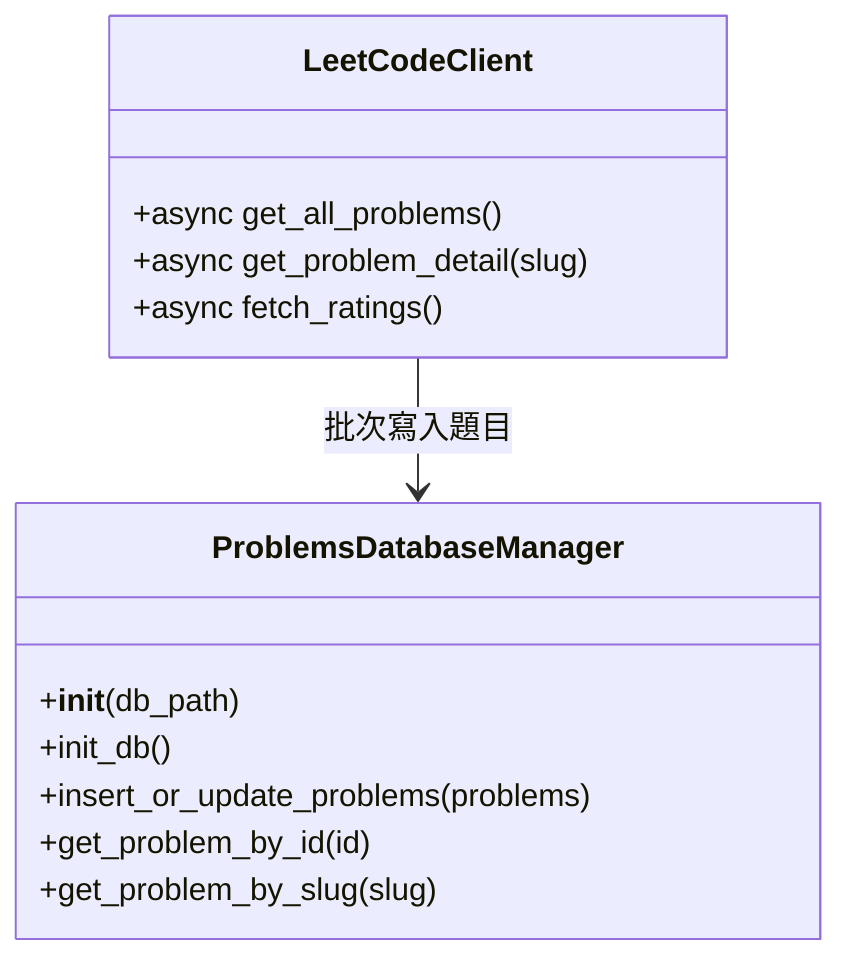

# LeetCode 題目資料抓取與資料庫設計合併方案

## 目標
- 合併 `leetcode_daily.py` 與 `leetcode_async_fetcher.py`，以非同步方式批次抓取 LeetCode 題目資料。
- 下載 rating 並以 question_id 對齊，無則預設 0。
- 所有題目資料統一寫入 `./data/data.db` 的 `problems` 資料表。
- 不再保留 json cache。
- 擴充 `utils/db_manager.py`，新增 `ProblemsDatabaseManager`，支援題目資料的批次插入與查詢。

---

## 資料表設計（problems）

| 欄位         | 型態      | 說明                |
|--------------|-----------|---------------------|
| id           | INTEGER   | LeetCode question_id（主鍵）|
| slug         | TEXT      | 題目英文 slug       |
| title        | TEXT      | 題目英文標題       |
| title_cn     | TEXT      | 題目中文標題（可空）|
| difficulty   | TEXT      | 難度（Easy/Medium/Hard）|
| ac_rate      | REAL      | 通過率（百分比）    |
| rating       | REAL      | 難度分數           |
| tags         | TEXT      | 標籤（JSON 字串）   |
| link         | TEXT      | 題目網址           |
| category     | TEXT      | 題目分類           |
| locked       | INTEGER   | 是否付費（0/1）    |

---

## 程式架構設計

### 1. LeetCodeClient（以 leetcode_async_fetcher.py 為主體）

- `async get_all_problems()`：非同步批次抓取所有題目，標準化欄位。
- `async fetch_ratings()`：下載 rating 並以 question_id 對齊。
- 整合 rating，統一回傳標準 dict。

### 2. ProblemsDatabaseManager（新增於 db_manager.py）

- `__init__(db_path)`：初始化資料庫連線。
- `init_db()`：建立 problems 資料表。
- `insert_or_update_problems(problems)`：批次插入或更新題目資料。
- `get_problem_by_id(id)`、`get_problem_by_slug(slug)`：查詢題目。

---

## Mermaid 類別/資料流結構圖

---

## 流程說明

1. LeetCodeClient 非同步抓取所有題目（含分類）。
2. 下載 rating 並以 question_id 對齊。
3. 整理成標準 dict，補齊所有欄位。
4. 批次寫入 `./data/data.db` 的 problems 資料表。
5. 可用 ProblemsDatabaseManager 查詢/更新題目。

---

## 實作重點

- 以非同步方式抓取所有題目，提升效率。
- rating 對齊以 frontendQuestionId/question_id 為主，無則預設 0。
- 資料表設計簡潔，便於後續查詢與擴充。
- 不再保留 json cache，所有資料統一進資料庫。

---